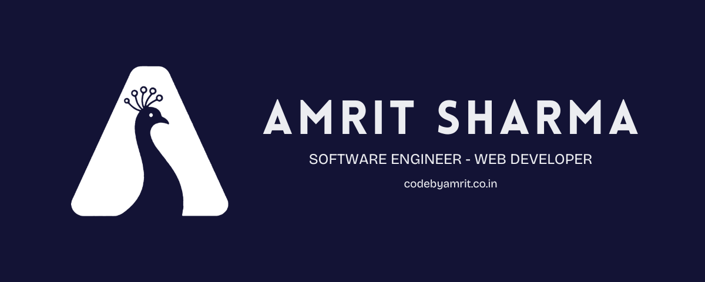

[](https://github.com/codebyamrit)
# Amrit Sharma Portfolio

Personal portfolio source for `https://amritsharma.dev`, built with Next.js App Router and exported as a static site.

## Stack

- Next.js `16.2.3`
- React `19`
- TypeScript
- Tailwind CSS `4`
- Framer Motion
- GSAP
- Lenis
- Umami analytics

## Project Structure

- `app/` App Router entrypoint, metadata, sitemap, robots, manifest
- `components/` Landing page sections and reusable UI
- `components/ui/` Interactive helpers such as custom cursor, magnetic UI, and smooth scrolling
- `public/` Static assets and `profile.html`

## Local Development

```bash
npm install
npm run dev
```

Open `http://localhost:3000`.

## Validation

```bash
npm run lint
npm run build
```

Use both commands before pushing structural, SEO, animation, or config changes.

## Deployment

The project is configured for static export:

- `next.config.ts` uses `output: "export"`
- generated output is written to `out/`
- GitHub Pages deployment is handled by `.github/workflows/deploy.yml`

## SEO Files

The main SEO setup lives in:

- `app/layout.tsx`
- `app/sitemap.ts`
- `app/robots.ts`
- `app/manifest.ts`

When updating branding, domain, or social links, keep those files in sync.

## Notes For Future Changes

- Preserve static export compatibility.
- Keep the site centered on the `Amrit Sharma` brand and portfolio.
- Avoid replacing the current motion-heavy premium design with a generic template style.
- Maintain `public/profile.html` unless it is intentionally being replaced.
