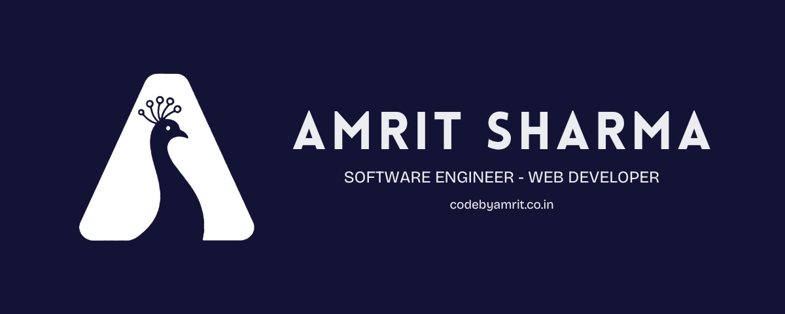

<h1 align="center">Hi, I'm Amrit! 👋</h1>

<h3 align="center">🚀 Full Stack & Systems Developer | AI & Automation Enthusiast</h3>

---

<h3 align="center">🧰 Languages and Tools</h3>

  

---

    

        
    

  

        <h3>🌐 Let's Connect!</h3>
        

            
            
        

  <h3>✨ Fun Facts</h3>
        <ul>
            <li>Building real-time systems like <strong>StreamVision</strong> with RTSP & FFmpeg.</li>
            <li>Love teaching AI through my chatbot project powered by Gemini API + Flask.</li>
            <li>Working on a movie recommender system called <strong>Chayan</strong> using NLP.</li>
            <li>Enjoy debugging, automation, and optimizing backend systems for performance.</li>
        </ul>

  <h3>🧑‍💻 About Me</h3>
        

            I'm a Computer Engineering student at UIET, MDU Rohtak, passionate about backend development, real-time streaming, and applied AI. 
        

        

            I love building systems that solve real problems — whether it's smart video streaming, data scraping, or intelligent recommendations. 
            Currently exploring cloud-native development, desktop apps with Electron, and ML integrations.
        

        

            GitHub is where I experiment, learn, and share — feel free to explore my repos or connect with me!
        

    

